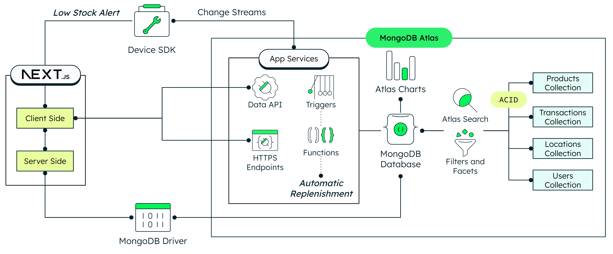

# Inventory Management App using MongoDB Atlas


In today's competitive landscape, balancing stock levels to meet demand without overstocking or understocking is crucial. Companies of all sizes struggle with Inventory Management. Solutions such as a single view of inventory, real-time analytics, and event-driven architectures can help your businesses overcome these challenges and take your inventory management to the next level. Additionally, with features like real-time sync, conflict resolution, and disconnection tolerance, our system ensures your inventory operations run seamlessly, no matter the circumstances. 

By the end of this guide, you'll have an inventory management up and running capable of all the solutions mentioned above. 

We will walk you through the process of configuring and using [MongoDB Atlas](https://www.mongodb.com/atlas) as your backend for your [Next.js](https://nextjs.org/) app, a powerful framework for building modern web applications with React. In addition to the well-known [Atlas Database](https://www.mongodb.com/atlas/database), [App Services](https://www.mongodb.com/products/platform/atlas-app-services) and [Atlas Edge Server](https://www.mongodb.com/products/platform/atlas-edge-server) will ensure seamless synchronization in an integrated and fully managed way.

The architecture we're about to set up is depicted in the diagram below:



If you want to learn more about Inventory Management and Event-Driven Architectures, visit the following pages:
- [How to Enhance Inventory Management with Real-Time Data Strategies](https://www.mongodb.com/blog/post/how-enhance-inventory-management-real-time-data-strategies)
- [How Atlas Edge Server Bridges the Gap Between Connected Retail Stores and the Cloud](https://www.mongodb.com/blog/post/how-atlas-edge-server-bridges-gap-between-connected-retail-store-cloud)
- [Build An Inventory Management System Using MongoDB Atlas](https://www.mongodb.com/developer/products/atlas/build-inventory-management-system-using-mongodb-atlas/)
- [Youtube Video](https://www.youtube.com/watch?v=sV2KfMk1CdM)
 
 Let's get started!

## Prerequisites
Before you begin working with this project, ensure that you have the following prerequisites set up in your development environment:

- **git** (version 2.39 or higher): This project utilizes Git for version control. Make sure you have Git installed on your system. You can download and install the latest version of Git from the official website: [Git Downloads](https://git-scm.com/downloads).

- **npm** (version 9.6 or higher): The project relies on npm (Node Package Manager) to manage dependencies and run scripts. You need to have npm installed on your machine. You can download Node.js from the official website: [Node.js Downloads](https://nodejs.org/en/download). After installing Node.js, npm will be available by default.

- **mongorestore** (version 100.9.4 or higher): The [mongorestore](https://www.mongodb.com/docs/database-tools/mongorestore/) tool loads data from a binary database dump. The [dump](dump) directory includes a demo database with preloaded collections, views and indexes, to get you up and running in no time. This tool is part of the [MongoDB Database Tools](https://www.mongodb.com/docs/database-tools/) package, follow the [Database Tools Installation Guide](https://www.mongodb.com/docs/database-tools/installation/installation/) to install `mongorestore`. When you are done with the installation, run `mongorestore --version` in your terminal to verify the tool is ready to use.

- **App Services CLI** (version 1.3.1 or higher): The [Atlas App Services Command Line Interface](https://www.mongodb.com/docs/atlas/app-services/cli/) (`appservices`) allows you to programmatically manage your Applications. We will use it to speed up the app backend set up by using the provided template in the [app_services](app_services) directory. App Services CLI is available on npm. To install the CLI on your system, ensure that you have [Node.js](https://nodejs.org/en/download/) installed and then run the following command in your shell: `npm install -g atlas-app-services-cli`.

- **Edge Server Dependencies** (Edge Server version 0.20.0 or higher): The Edge Server will enable our app with real-time sync, conflict resolution and disconnection tolerance. It requires several dependencies, which are listed in the [README.md](edge_server/README.md) of the edge_server directory. Follow the instructions to install the required dependencies. To learn more, visit our documentation on how to [Configure Edge Server](https://www.mongodb.com/docs/atlas/app-services/edge-server/configure/).

- **MongoDB Atlas Cluster** (M0 or higher): This project uses a MongoDB Atlas cluster to manage the database. You should have a MongoDB Atlas account and a minimum free tier cluster set up. If you don't have an account, you can sign up for free at [MongoDB Atlas](https://www.mongodb.com/cloud/atlas/register). Once you have an account, follow these steps to set up a minimum free tier cluster or follow the [Getting Started](https://www.mongodb.com/docs/atlas/getting-started/) guide:
  - Log in to your MongoDB Atlas account.
  - Create a new project or use an existing one, and then click “create a new database”.
  - Choose the free tier option (M0).
  - You can choose the cloud provider of your choice but we recommend using the same provider and region both for the cluster and the app hosting in order to improve performance. 
  - Configure the cluster settings according to your preferences and then click “finish and close” on the bottom right.

## Initial Configuration

### Obtain your Connection String

Once the MongoDB Atlas Cluster is set up, locate your newly created cluster, click the "Connect" button and select the "Compass" section. Copy the provided connection string. It should resemble something like this:

   ```
   mongodb+srv://<username>:<password>@cluster-name.xxxxx.mongodb.net/
   ```
   
> [!Note]
> You will need the connection string to set up your environment variables later (`MONGODB_URI`).

### Cloning the Github Repository

Now it's time to clone the [demo app source code from GitHub](https://github.com/mongodb-industry-solutions/Inventory_mgmt) to your local machine:

1. Open your terminal or command prompt.

2. Navigate to your preferred directory where you want to store the project using the `cd` command. For example:

   ```bash
   cd /path/to/your/desired/directory
   ```

3. Once you're in the desired directory, use the `git clone` command to clone the repository. Copy the repository URL from the GitHub repository's main page:

   ```bash
   git clone git@github.com:mongodb-industry-solutions/Inventory_mgmt.git
   ```

4. After running the `git clone` command, a new directory with the repository's name will be created in your chosen directory. To navigate into the cloned repository, use the `cd` command:

   ```bash
   cd Inventory_mgmt
   ```

## MongoDB Atlas Configuration

### Replicate the Demo Database

To replicate the demo database on your MongoDB Atlas cluster, run the following command in your terminal:

   ```bash
   mongorestore --uri <your-connection-string> dump/
   ```

Make sure to replace `<your-connection-string>` with your MongoDB Atlas connection string. If you've already followed the initial configuration steps, you should have obtained this connection string. Ensure that the URI includes the username, password, and cluster details.

After executing these commands, you can verify the successful restoration of the demo database by checking the last line of the command output, which should display "22 document(s) restored successfully."
The demo database contains:
- 3 users
- 2 locations
- 17 products
- A view used by the area manager user to aggregate the stock of different locations
- An index in the transactions collection to speed up transaction retrieval.

> [!Note]
> You will need the database name to set up your environment variables later (`MONGODB_DATABASE_NAME`).
> If the database name has not been specified, the default name will be `inventory_management_demo`.

### Import the App Backend with Atlas App Services

To enable to enable real-time sync, change streams and workflow automation triggers, follow these steps to set up Atlas App Services:

1. First, let's make sure that the App Services configuration is correct. If you are building this app on an existing cluster that isn't named `Cluster0`, you should go to [app_services/data_sources/mongodb-atlas/config.json](app_services/data_sources/mongodb-atlas/config.json) and edit the clusterName field such as `"clusterName": "<your-cluster-name>"`.

2. Then you will need to [generate your API Key](https://www.mongodb.com/docs/atlas/app-services/cli/#generate-an-api-key) pair to authenticate your CLI calls. Navigate to MongoDB Cloud Access Manager, click the "Create API Key" button and select the `Project Owner` permission level. For an extra layer of security, you can add your current IP address to the Access List Entry.

3. Authenticate your CLI user by running the command below in your terminal. Make sure you replace the public and private api keys with the ones we just generated in the previous step. 

   ```bash
   appservices login --api-key="<my api key>" --private-api-key="<my private api key>"
   ```

4. Import the app by running the following command. Remember to replace `<your-app-name>` by your preferred name.  

   ```bash
   appservices push --local ./app_services/ --remote <your-app-name>
   ```

   You will be prompted to configure the app options. Set them according to your needs. If you are unsure which options to choose, the default ones are usually a good way to start! For example, this is the configuration I've used.

   ```console
   ? Do you wish to create a new app? Yes
   ? App Name inventory-management-demo
   ? App Deployment Model LOCAL
   ? Cloud Provider aws
   ? App Region aws-eu-west-1
   ? App Environment testing
   ? Please confirm the new app details shown above Yes
   ```

   Once the app is successfully created, you will be asked to confirm some changes. These changes will load the functions, triggers, HTTP endpoints and other configuration parameters our inventory management system will use. 
   
   After some seconds you will see a success message like `Successfully pushed app up: <your-app-id>`. Take note of the obtained App Id.

5. In addition to the App Id, our front end will also need the base URL to send HTTP requests to the backend. Run the command below in your terminal to obtain it. Remember to replace `<your-app-id>` with your own value. The `jq` tool will help us to get the appropriate field and format. Take note of the obtained URI.

   ```
   appservices apps describe --app <your-app-id> -f json | jq -r '.doc.http_endpoints[0].url | split("/") | (.[0] + "//" + .[2])'
   ```

6. Finally, our calls to the backend will need to be authenticated. For this reason we will create an API Key that will be used by the server-side of our inventory management system to generate an access token. It is only this Access Token what will be passed to the client-side of the system to authenticate the calls to the backend.

   Again, before running the command, remember to replace the placeholder`<your-app-id>`.

   ```
   appservices users create --type=api-key --app=<your-app-id> --name=tutorial-key
   ```

   After a few seconds you should see the message `Successfully created API Key` followed by a JSON object. Copy the content of the field `key` and store it in a secure place. Remember that if you lose this key you will need to create a new one.

> [!Important]
> This API Key is not the same as the key used to login in the `appservices` CLI.
   
> [!Note]
> You will need the App ID, base App Services URI, and API Key to set up your environment variables later (`REALM_APP_ID`, `APP_SERVICES_URI`, `API_KEY`).

### Set up Atlas Search and Filter Facets
Follow these steps to configure search indexes for full-text search and filter facets:

1. Navigate to the "Data Services" section within Atlas. Select your cluster and click on "Atlas Search" located next to "Collections".

2. If you are in the M0 tier, you can create two search indexes for the products collection. This will allow you to merely search across the products collection; however, if you have a tier above M0, you can create additional search indexes. This will come handy if you want to search and filter not only across your product catalog but also your transaction records such as sales and replenishment orders.

3. Let's begin with creating the indexes for full-text search:
   - Click "Create Search Index".
   - You can choose to use either the Visual or JSON editor. Select "JSON Editor" and click "Next".
   - Leave the index name as "default".
   - Select your newly created database and choose the *products* collection. We will leave the default index definition, which should look like the one below.

      ```json
      {
         "mappings": {
            "dynamic": true
         }
      }
      ```
   - Click "Next" and, in the next screen, confirm by clicking "Create Search Index".
   - After a few moments, your index will be ready for use. While you wait, you can create the other search index for the *transactions* collection. You need to repeat the same process but change the selected collection in the "Database and Collection" menu next to the JSON Editor.
  
> [!Important]
> The name of the index (`default`) must be the same in order for the application to be able to work properly. 

4. Now, let's proceed to create the indexes required for the filter facets. Note that this process is slightly different from creating default search indexes:
   - Click "Create Index" again, select the JSON Editor, and click "Next".
   - Name this index "facets".
   - Select your database and the *products* collection. For the index definition, paste the code below.

      - **Facets Index Definition for Products**
      ```json
      {
         "mappings": {
            "dynamic": false,
            "fields": {
               "items": {
               "fields": {
                  "name": {
                     "type": "stringFacet"
                  }
               },
               "type": "document"
               },
               "name": {
               "type": "stringFacet"
               }
            }
         }
      }
      ```

   - Click "Next" and confirm by clicking "Create Search Index". The indexing process will take some time. You can create the *transactions* index while waiting for the indexing to complete. In order to do that just repeat the process but changing the selected collection and the index definition by the one below:

      - **Facets Index Definition for Transactions**
      ```json
      {
         "mappings": {
            "dynamic": false,
            "fields": {
               "items": {
               "fields": {
                  "name": {
                     "type": "stringFacet"
                  },
                  "product": {
                     "fields": {
                     "name": {
                        "type": "stringFacet"
                     }
                     },
                     "type": "document"
                  }
               },
               "type": "document"
               }
            }
         }
      }
      ```
  
> [!Important]
> The name of the index (`facets`) must be the same in order for the application to be able to work properly. 

By setting up these search indexes and filter facets, your application will gain powerful search and filtering capabilities, making it more user-friendly and efficient in managing inventory data.

### Set up Atlas Charts

Enhance your application's visualization and analytics capabilities with Atlas Charts. Follow these steps to set up two dashboards—one for product information and another for general analytics:

1. Navigate to the "Charts" section located next to "App Services".

2. Let's begin by creating the product dashboard:
   - If this is your first time using Atlas Charts, click on “Chart builder”. Then select the relevant project, the database, and the collection. 
   - If you’ve already used Atlas Charts (i.e. not a first-time user), then click on "Add Dashboard" in the top right corner. Give the dashboard a name and an optional description. Choose a name that clearly reflects the purpose of the dashboard. You don't need to worry about the charts in the dashboard for now. You'll configure them after the app is ready to use.

3. Return to the Dashboards menu, click on the three dots in the top right corner of the newly created dashboard, and select "Embed".

4. Check the "Enable unauthenticated access" option. In the "Allowed filter fields" section, edit the fields and select "Allow all fields in the data sources used in this dashboard". Choose the embedding method through the JavaScript SDK, and copy both the "Base URL" and the "Dashboard ID". Click close.

5. Repeat the same process for the general dashboard. Select products again, as we will update this once the app has generated data.  Note that the "Base URL" will be the same for both dashboards but the “dashboard ID” will be different so please take note of it.

> [!Note]
> You will need the base URL and dashboard IDs to set up your environment variables later (`CHARTS_EMBED_SDK_BASEURL`, `DASHBOARD_ID_PRODUCT`, `DASHBOARD_ID_GENERAL`).

Setting up Atlas Charts will provide you with visually appealing and insightful dashboards to monitor product information and overall analytics, enhancing your decision-making process and improving the efficiency of your inventory management system.

## Configure Edge Server

Edge Server is a "local" server that sits between your client devices and MongoDB Atlas App Services. For most use cases, you'll provision hardware on-premises to host the Edge Server. While you're developing your Edge Server application, you may host it on your own device or a cloud server for convenience. To learn more about hosting options please visit our [Edge Server Host Requirements](https://www.mongodb.com/docs/atlas/app-services/edge-server/configure/#edge-server-host-requirements) documentation.

Follow these instructions to set up and run the Edge Server on your own device:

1. In your terminal, navigate to the [edge_server](/edge_server) directory. 

   ```bash
   cd edge_server
   ```

2. Edge Server requires several dependencies, which are listed in the [README](edge_server/README.md) file in the edge_server directory. If you haven't completed this step in the prerequisites section, you will need to do it now.

3. We will configure Edge Server using the command-line tool `edgectl`. By default, this tool will be installed at ``.mongodb-edge` in your home directory. You can reference the entire path to use this tool, `~/.mongodb-edge/bin/edgectl`, or simply add it to your PATH by running the command below: 

   ```bash
   export PATH="~/.mongodb-edge/bin/:$PATH"
   ```

   The next command will generate a docker-compose file in your current directory with all the necessary steps to deploy and manage your Edge Server instance. Replace `<your-app-id>` with the value obtained in the first part of this tutorial series, and `<your-auth-secret>` with the token generated in the previous section. You will also need to specify the deployment region where your app service was deployed,  `<cloud-region>` and `<cloud-provider>`. 

   ```bash
   edgectl config --platform compose --app-id <your-app-id> --insecure-disable-auth --registration-token <your-registration-token> --cloud-sync-server-base-url=https://<cloud-region>.<cloud-provider>.services.cloud.mongodb.com
   ```

> [!Tip]
> To learn more about each of the config flags, visit our documentation on how to [Install and Configure the Edge Server](https://www.mongodb.com/docs/atlas/app-services/edge-server/configure/).
   
4. This application is able to simulate offline scenarios by setting the edge server connectivity off. In order to enable this feature in the Edge Server, run the command below.

   ```bash
   edgectl offline-demo setup
   ```

5. To start the server, from the edge_server directory run:

   ```bash
   edgectl up
   ```

   Check the status by running `edgectl status`, you should see the value `"cloud_connected": true` indicating that the Edge Server is connected to MongoDB Atlas.


> [!Important]
> Once you are done with the tutorial, remember to stop the server by running `edgectl down` in the edge_server directory.


## Frontend Configuration

### Set up Environment Variables

Navigate to the [app](app) directory. If you are currently in the [edge_server](edge_server) one, you can run the command below:

```bash
cd ../app
```

Now copy the `env.local.example` file in this directory to `.env.local` (which will be ignored by Git) as seen below:

```bash
cp .env.local.example .env.local
```
Now open this file in your preferred text editor or IDE and update each variable on `.env.local`.

Remember all of the notes you took earlier? Grab them because you’ll use them now! Remember to remove any spaces after the equal sign. 

- `MONGODB_URI` - Your MongoDB connection string to [MongoDB Atlas](https://mongodb.com/atlas). You can find this by clicking the "Connect" button for your cluster. Note that you will have to input your Atlas password into the connection string.
- `EDGE_SERVER_HOST` - This is the address of the server hosting your Edge Server instance. If you run the instance locally, just type `localhost` here.
- `MONGODB_DATABASE_NAME` - Your MongoDB database name for inventory management. If no database name has been specified during the set up process just write `inventory_management_demo`.
- `REALM_APP_ID` - This variable should contain the App ID of the MongoDB Atlas App Services app you've created for the purpose of this project.
- `APP_SERVICES_URI` - This is the base URL for your MongoDB App Services. It typically follows the format `https://<cloud-region>.<cloud-provider-code>.data.mongodb-api.com`.
- `API_KEY` - Your API Key for authenticating calls using the MongoDB Data API.
- `CHARTS_EMBED_SDK_BASEURL` - This variable should hold the URL of the charts you want to embed in your application.
- `DASHBOARD_ID_PRODUCT` - This variable should store the Atlas Charts dashboard ID for product information.
- `DASHBOARD_ID_GENERAL` - This variable should store the Atlas Charts dashboard ID for the general analytics tab.
- `DEMO_INDUSTRY` - For demo purposes, this variable will slightly change the UI based on the use case's industry focus. You can choose either `retail` or `manufacturing`.

Please remember to save the updated file.

### Run locally
Execute the following commands to run your app locally: 

```bash
npm ci
npm run dev
```

Your app should be up and running on [http://localhost:3000](http://localhost:3000)! If it doesn't work, ensure that you have provided the correct environment variables.

## Personalize your App (Optional)

### Configure your Charts
Congratulations! Now your app is up and running… but have you noticed anything odd? Your charts are empty! Let’s fix this.

Go to your product-related dashboard and change the collection from products to orders in the data source button on the upper left. Consider including a chart showing the number of orders for the last day, grouped by hour. 

For detailed instructions on how to set up your [Atlas Charts](https://www.mongodb.com/docs/charts/), refer to the official documentation.

### Enable Real-Time Analytics

1. To create a general analytics dashboard based on sales, we will need to generate sales data. Navigate to the control panel in your app by clicking: 
[http://localhost:3000/control](http://localhost:3000/control)
2. Then click the “start selling” button. When you “start selling”, remember to not close this window as selling will only work when the window is open. This will simulate a sale every 5 seconds, so we recommend letting it run for a couple of minutes.
3. In the meantime, navigate back to Atlas Charts to create a general analytics dashboard. For example, you can create a line graph that displays sales over the last hour, minute by minute. Now you’ll see live data coming in, offering you real-time insights! 

Your app is ready to go! For the first time, you may need to refresh the website to see the updated charts, but after that, the charts will update automatically syncing with the new sales. 

## Additional Resources
Congratulations! Your inventory management app is ready to go.

We’ve covered multiple use cases in this demo, but feel free to build on top of it for your own use cases. 

Check additional and accompanying resources below: 
- [MongoDB for Retail Innovation](https://www.mongodb.com/industries/retail)
- [Building an event-driven inventory management system](https://www.mongodb.com/solutions/solutions-library/event-driven-inventory-management)
- [Atlas Edge Server](https://www.mongodb.com/docs/atlas/app-services/edge-server/)


