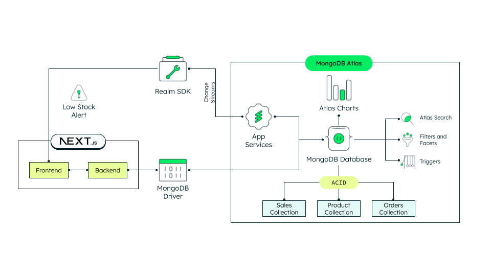

## Inventory Management App using MongoDB Atlas
In the competitive retail landscape, having the right stock in the right palce at the right time is crucial. Too little inventory when and where it’s needed can create unhappy customers. But a large inventory can increase costs and risks associated with its storage. Companies of all sizes struggle with Inventory Management. Solutions such a single view of inventory, real-time analytics and event-driven architectures can help you businesses overcome these challenges and take your inventory management to the next level. By the end of this guide, you'll have an inventory management up and running an capable of all the solutions mentioned above. We will walk you through the process of configuring and using [MongoDB Atlas](https://mongodb.com/atlas) as your backend for your [Next.js](https://nextjs.org/) app, a powerful framework for building modern web applications with React.

The architecture we're about to set up is depicted in the diagram below:



If you want to learn more about Inventory Management and Event-Driven Architectures, visit the following pages:
- How to Enhance Inventory Management with Real-Time Data Strategies
- How to Build An Event-Driven Inventory Management System Using MongoDB Atlas
- Youtube Video 
 
 Let's get it started!

## Prerequisites
Before you begin working with this React [Next.js](https://nextjs.org/) project, ensure that you have the following prerequisites set up on your development environment:
- **git** (version 2.39 or higher): This project utilizes Git for version control. Make sure you have Git installed on your system. You can download and install the latest version of Git from the official website: [Git Downloads](https://git-scm.com/downloads).
- **npm** (version 9.6 or higher): The project relies on npm (Node Package Manager) to manage dependencies and run scripts. You need to have npm installed on your machine. You can download Node.js from the official website: [Node.js Downloads](https://nodejs.org/en/download). After installing Node.js, npm will be available by default.
- **MongoDB Atlas Cluster** (Minimum Free Tier): This project uses a MongoDB Atlas cluster to manage the database. You should have a MongoDB Atlas account and a minimum free tier cluster set up. If you don't have an account, you can sign up for free at [MongoDB Atlas](https://www.mongodb.com/cloud/atlas/register). Once you have an account, follow these steps to set up a minimum free tier cluster:
  - Log in to your MongoDB Atlas account.
  - Create a new project or use an existing one.
  - Within the project, click "Build a Cluster" to create a new cluster.
  - Choose the free tier option if available.
  - Configure the cluster settings according to your preferences.
  - After the cluster is set up, note down the connection string for later use.

## MongoDB Atlas Configuration

### Set up a MongoDB Atlas Cluster

To get started with MongoDB Atlas, follow these steps to set up your cluster and database:

1. Once the cluster is set up, click the "Connect" button and select the "Drivers" section. Choose the latest version of Node.js and copy the provided connection string. It should resemble something like this:

   ```
   mongodb+srv://<username>:<password>@cluster-name.n0kts.mongodb.net/?retryWrites=true&w=majority
   ```
   
> **Note**
> You will need this to set up your environment variables later (`MONGODB_URI`).


3. Proceed to the "Browse Collections" section in your MongoDB Atlas dashboard. Create a new database, choosing a name that suits your application, such as "inventory_management".
> **Note**
> You will need this to set up your environment variables later (`MONGODB_DATABASE_NAME`).

4. Inside the newly created database, set up three collections:
   - **Products**: This collection will store your product and stock data.
   - **Orders**: This collection will track order details when orders are placed through the application.
   - **Sales**: This collection will store information about sales transactions made. The application can simulate sales flows on demand.

5. For the initial setup, you can manually create products within the "Products" collection. Ensure that you follow the defined data schema. If you prefer, you can load predefined products available [here](https://github.com/mongodb-industry-solutions/Inventory_mgmt/blob/main/data/products.json). You can insert these documents using tools such as MongoDB Atlas, MongoDB Compass, or the MongoShell.

### Set up Atlas App Services

To enable real-time capabilities for your Next.js application, follow these steps to set up Atlas App Services:

1. Navigate to the "App Services" section in Atlas, which is located next to "Data Services".

2. Click on "Create a New App". Provide a name for your app and link it to the database you previously created. Confirm the creation of the app service.

3. Once you're inside your application, make a note of the automatically generated App ID. It will have a format similar to:

   ```
   my-app-name-xxxxx
   ```
> **Note**
> You will need this to set up your environment variables later (`REALM_APP_ID`).

4. In the sidebar menu under "Data access", navigate to "Rules". Locate your database and grant "Search" permissions to both the *products* and *sales* collections.

5. Proceed to the "Authentication" section. Enable the option to "Allow users to log in anonymously". This will provide a simple way for users to interact with your app without requiring explicit authentication.

For a more comprehensive guide on this process, you can refer to the tutorial [Real-Time Data in a React JavaScript Front-End with Change Streams](https://www.mongodb.com/developer/products/mongodb/real-time-data-javascript/).

### Set up Atlas Search and Filter Facets
Follow these steps to configure search indexes for full-text search and filter facets:

1. Return to the "Data Services" section within Atlas. Select your cluster and click on "Search" located next to "Collections".

2. You will need to create a total of six search indexes, two for each collection — one for search and another for filter facets.

3. Let's begin with creating the indexes for full-text search:
   - Click "Create Index" in the top right corner of the screen.
   - You can choose to use either the Visual or JSON editor. For the purposes of this tutorial, let's stick with the Visual Editor. Click "Next".
   - Leave the index name as "default".
   - Select your database and choose one of the three collections created (e.g., *products*).
   - Keep the default Index Configurations unchanged and click "Create Index".
   - After a few moments, your index will be ready for use. While you wait, you can proceed to create the other two search indexes for the *orders* and *sales* collections.
  
> **Important**
> The name of the index must be the same in order for the application to be able to work properly. 

4. Now, let's proceed to create the indexes required for the filter facets. Note that this process is slightly different from creating default search indexes:
   - Click "Create Index" again, select the Visual Editor, and click "Next".
   - Name this index "facets".
   - Select your database and one of the three collections for which you're creating these types of indexes. Click "Next".
   - Choose "Refine Your Index", deactivate "Dynamic Mapping", and add the Field Mappings as specified below for each collection:

     **Products Collection:**
     | Field Name | Data Type    |
     | ---------- | ------------ |
     | color.name | StringFacet  |
     | items.size | StringFacet  |

     **Orders Collection:**
     | Field Name     | Data Type    |
     | -------------- | ------------ |
     | items.color.name | StringFacet |
     | items.size     | StringFacet  |

     **Sales Collection:**
     | Field Name | Data Type    |
     | ---------- | ------------ |
     | color.name | StringFacet  |
     | size       | StringFacet  |

   - Confirm "Create Index". The indexing process will take some time. You can create indexes for other collections while waiting for the indexing to complete.
  
> **Important**
> The name of the index must be the same in order for the application to be able to work properly. 

By setting up these search indexes and filter facets, your application will gain powerful search and filtering capabilities, making it more user-friendly and efficient in managing inventory data.

### Set up Atlas Charts

Enhance your application's visualization and analytics capabilities with Atlas Charts. Follow these steps to set up two dashboards—one for product information and another for general analytics:

1. Navigate to the "Charts" section located next to "App Services".

2. Let's begin by creating the dashboards:
   - Click on "Add Dashboard" in the top right corner. Give the dashboard a name and an optional description. Choose a name that clearly reflects the purpose of the dashboard.
   - Add the desired charts and styles to the dashboard. For the product-related dashboard, consider including a chart showing the number of orders for the last day, grouped by hour. For the general analytics dashboard, a line graph displaying sales over the last hour, minute by minute, can offer real-time insights.
   - For detailed instructions on how to set up your [Atlas Charts](https://www.mongodb.com/docs/charts/), refer to the official documentation.

3. After you've configured the dashboard with your preferred charts, return to the Dashboards menu. Click on the three dots in the top right corner of the newly created dashboard and select "Embed".

4. Check the "Enable unauthenticated access" option. In the "Allowed filter fields" section, edit the fields and select "Allow all fields in the data sources used in this dashboard". Choose the embedding method through the JavaScript SDK, and copy both the "Base URL" and the "Dashboard ID".

5. Repeat the same process for both the general and product dashboards. Note that the "Base URL" will be the same for both dashboards.

> **Note**
> You will need this to set up your environment variables later (`CHARTS_EMBED_SDK_BASEURL`, `DASHBOARD_ID_PRODUCT`, `DASHBOARD_ID_GENERAL`).

Setting up Atlas Charts will provide you with visually appealing and insightful dashboards to monitor product information and overall analytics, enhancing your decision-making process and improving the efficiency of your inventory management system.

### Set up the Database Trigger for Autoreplenishment

Automate inventory replenishment by setting up a database trigger in MongoDB Atlas. Follow these steps to enable the trigger:

1. Navigate to the "Data Services" section within Atlas. In the sidebar menu, click on "Triggers".

2. Select "Add Trigger".

3. Choose the trigger type as "Database". Provide a name for the trigger and select your cluster, database, and the *products* collection. Set the operation type to "Update" only. Ensure that both "Full Document" and "Document Preimage" are enabled.

4. In the "Function" section, copy the code available at [/data/triggers/autoreplenishment.js](https://github.com/mongodb-industry-solutions/Inventory_mgmt/blob/main/data/triggers/autoreplenishment.js).

5. Open the "Advanced" section and insert the following code into the "Match Expression" field. This expression will ensure that the trigger function is executed only for products marked for auto-replenishment:

   ```json
    {
        "fullDocument.autoreplenishment": true
    }
   ```

6. Verify that all the configuration details are accurate and click "Save".

7. For additional assistance, you can refer to the official documentation on how to create a [Database Trigger](https://docs.mongodb.com/stitch/triggers/database-triggers/).

### Set up the Database Trigger for Order Number Autoincrement (Optional)
You can optionally set up a database trigger that automatically increments order numbers. To achieve this, follow these steps:

Just as in the previous section, navigate to the "Triggers" area within the "Data Services" section in Atlas. Create a new trigger by clicking "Add Trigger".

For comprehensive instructions on configuring this trigger, you can refer to the tutorial [MongoDB Auto Increment](https://www.mongodb.com/basics/mongodb-auto-increment).

The customized function for this specific application's auto-increment can be accessed at [data/triggers/insertOrderFunction](https://github.com/mongodb-industry-solutions/Inventory_mgmt/blob/main/data/triggers/insertOrderFunction.js).

### Set up Additional Indexes (Optional)

Enhance the performance and responsiveness of your application by setting up additional indexes. Indexes can significantly improve loading times, especially when dealing with large volumes of data.

Unlike Search Indexes, this type of index configuration requires navigating to the specific collection where you want to establish the index. Here's how you can do it:

1. Go to the collection where you want to create the index. From there, select the "Indexes" tab.

2. Create a new index for the collection. For charts that involve filtering by date and product, such as orders and sales charts, consider utilizing a compound index. This type of index involves multiple fields and can significantly speed up query execution.

For example, for the *orders* collection, you might consider creating a compound index like this:

```json
{
  "placement_timestamp": -1,
  "items.product.id": 1
}
```

The above index configuration prioritizes sorting by the placement timestamp in descending order and then by the product's `_id` field in ascending order.

## App Configuration

### Cloning the Github Repository

Follow these steps to clone the GitHub repository to your local machine:

1. Open your terminal or command prompt.

2. Navigate to the directory where you want to store the project using the `cd` command. For example:

   ```bash
   cd /path/to/your/desired/directory
   ```

3. Once you're in the desired directory, use the `git clone` command to clone the repository. Copy the repository URL from the GitHub repository's main page:

   ```bash
   git clone https://github.com/mongodb-industry-solutions/Inventory_mgmt.git
   ```

4. After running the `git clone` command, a new directory with the repository's name will be created in your chosen directory. To navigate into the cloned repository, use the `cd` command:

   ```bash
   cd Inventory_mgmt
   ```

Now you have successfully cloned the GitHub repository to your local machine. You can proceed with setting up the required environment variables and following the other steps mentioned in the README to configure and run the React Next.js project.

If you encounter any issues during the cloning process or while setting up the project, refer to the project's documentation or seek help from relevant communities or forums.

### Set up Environment Variables

Copy the `env.local.example` file in this directory to `.env.local` (which will be ignored by Git):

```bash
cp .env.local.example .env.local
```

Set each variable on `.env.local`:

- `MONGODB_URI` - Your MongoDB connection string to [MongoDB Atlas](https://mongodb.com/atlas). You can find this by clicking the "Connect" button for your cluster.
- `MONGODB_DATABASE_NAME` - Your MongoDB database name for inventory management.
- `REALM_APP_ID` - This variable should contain the App ID of the MongoDB Atlas App Services app you've created for the purpose of this project.
- `CHARTS_EMBED_SDK_BASEURL` - This variable should hold the URL of the charts you want to embed in your application.
- `DASHBOARD_ID_PRODUCT` - This variable should store the Atlas Charts dashboard ID for product information.
- `DASHBOARD_ID_GENERAL` - This variable should store the Atlas Charts dashboard ID for the general analytics tab.

### Run locally
Execute the following commands to run your app locally: 

```bash
npm install
npm run dev

# or

yarn install
yarn dev
```

Your app should be up and running on [http://localhost:3000](http://localhost:3000)! If it doesn't work, ensure that you have provided the correct environment variables.

## Deploy on AWS Amplify (Optional)

If you're considering hosting your application, [AWS](https://aws.amazon.com/) provides a robust hosting service that can be highly advantageous for deploying applications like this one. One of the services AWS offers is [Amplify](https://aws.amazon.com/amplify/), a platform that simplifies the deployment of web applications, enabling you to easily host and manage your projects.

AWS Amplify provides a seamless integration for deploying Next.js applications. It streamlines the deployment process, allowing you to focus on your application's functionality rather than the intricacies of deployment. To learn more about how to host a Next.js application using AWS Amplify, you can refer to the guide [here](https://aws.amazon.com/blogs/mobile/amplify-next-js-13/).

When deploying with AWS Amplify, ensure you set up your environment variables appropriately. These variables are crucial for your application to function correctly both during runtime and build time. Here's an example of a build script you can use in the AWS Amplify configuration:

```yaml
version: 1
frontend:
  phases:
    preBuild:
      commands:
        - npm ci
    build:
      commands:
        - env | grep -e MONGODB_URI -e REALM_APP_ID -e CHARTS_EMBED_SDK_BASEURL -e DASHBOARD_ID_PRODUCT -e DASHBOARD_ID_GENERAL -e MONGODB_DATABASE_NAME >> .env.production
        - npm run build
  artifacts:
    baseDirectory: .next
    files:
      - '**/*'
  cache:
    paths:
      - node_modules/**/*
```

This script helps ensure that your environment variables are correctly configured both in the general environment variables section and during the build process.
