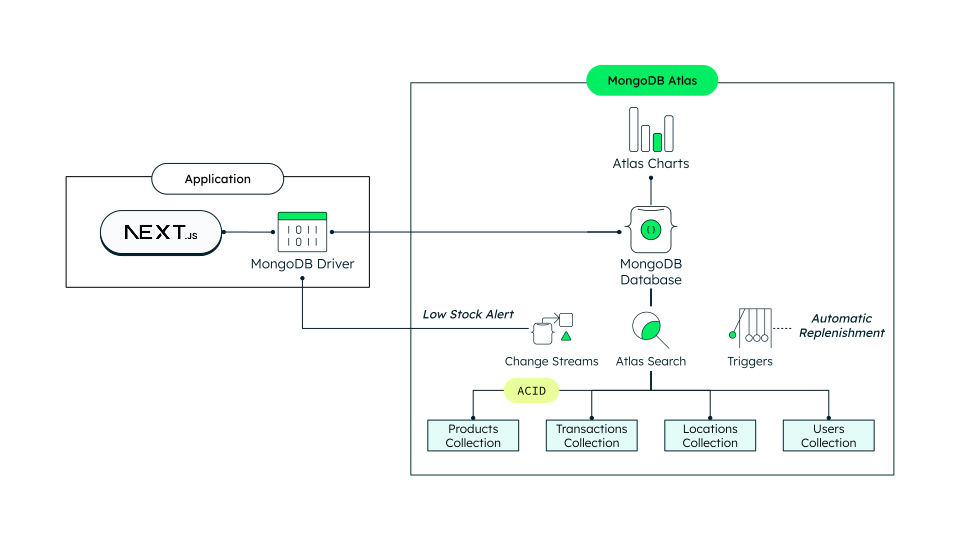

# Inventory Management App using MongoDB Atlas


In today's competitive landscape, balancing stock levels to meet demand without overstocking or understocking is crucial. Companies of all sizes struggle with Inventory Management. Solutions such as a single view of inventory, real-time analytics, and event-driven architectures can help your businesses overcome these challenges and take your inventory management to the next level. Additionally, with features like real-time sync, conflict resolution, and disconnection tolerance, our system ensures your inventory operations run seamlessly, no matter the circumstances.

By the end of this guide, you'll have an inventory management up and running capable of all the solutions mentioned above.

We will walk you through the process of configuring and using [MongoDB Atlas](https://www.mongodb.com/atlas) as your backend for your [Next.js](https://nextjs.org/) app, a powerful framework for building modern web applications with React.

The architecture we're about to set up is depicted in the diagram below:



If you want to learn more about Inventory Management and Event-Driven Architectures, visit the following pages:

- [How to Enhance Inventory Management with Real-Time Data Strategies](https://www.mongodb.com/blog/post/how-enhance-inventory-management-real-time-data-strategies)
- [Solutions Library](https://www.mongodb.com/solutions/solutions-library/event-driven-inventory-management)
- [Tutorial (Coming soon!)](https://www.mongodb.com/developer/)
- [Youtube Video](https://www.youtube.com/watch?v=sV2KfMk1CdM)

Let's get started!

## Prerequisites

Before you begin working with this project, ensure that you have the following prerequisites set up in your development environment:

- **npm** (version 9.6 or higher): The project relies on npm (Node Package Manager) to manage dependencies and run scripts. You need to have npm installed on your machine. You can download Node.js from the official website: [Node.js Downloads](https://nodejs.org/en/download). After installing Node.js, npm will be available by default.

- **mongorestore** (version 100.9.4 or higher): The [mongorestore](https://www.mongodb.com/docs/database-tools/mongorestore/) tool loads data from a binary database dump. The [dump](dump) directory includes a demo database with preloaded collections, views and indexes, to get you up and running in no time. This tool is part of the [MongoDB Database Tools](https://www.mongodb.com/docs/database-tools/) package, follow the [Database Tools Installation Guide](https://www.mongodb.com/docs/database-tools/installation/installation/) to install `mongorestore`. When you are done with the installation, run `mongorestore --version` in your terminal to verify the tool is ready to use.

- **MongoDB Atlas Cluster** (M0 or higher): This project uses a MongoDB Atlas cluster to manage the database. You should have a MongoDB Atlas account and a minimum free tier cluster set up. If you don't have an account, you can sign up for free at [MongoDB Atlas](https://www.mongodb.com/cloud/atlas/register). Once you have an account, follow these steps to set up a minimum free tier cluster or follow the [Getting Started](https://www.mongodb.com/docs/atlas/getting-started/) guide:
  - Log in to your MongoDB Atlas account.
  - Create a new project or use an existing one, and then click “create a new database”.
  - Choose the free tier option (M0).
  - You can choose the cloud provider of your choice but we recommend using the same provider and region both for the cluster and the app hosting in order to improve performance.
  - Configure the cluster settings according to your preferences and then click “finish and close” on the bottom right.
  - Finally, add your IP to the network access list so you can access your cluster remotely.

## Initial Configuration

### Obtain your Connection String

Once the MongoDB Atlas Cluster is set up, locate your newly created cluster, click the "Connect" button and select the "Compass" section. Copy the provided connection string. It should resemble something like this:

```
mongodb+srv://<username>:<password>@cluster-name.xxxxx.mongodb.net/
```

> [!Note]
> You will need the connection string to set up your environment variables later (`MONGODB_URI`).

### Cloning the Github Repository

Now it's time to clone the [demo app source code from GitHub](https://github.com/mongodb-industry-solutions/inventory-management) to your local machine:

1. Open your terminal or command prompt.

2. Navigate to your preferred directory where you want to store the project using the `cd` command. For example:

   ```bash
   cd /path/to/your/desired/directory
   ```

3. Once you're in the desired directory, use the `git clone` command to clone the repository. Copy the repository URL from the GitHub repository's main page:

   ```bash
   git clone git@github.com:mongodb-industry-solutions/inventory-management.git
   ```

4. After running the `git clone` command, a new directory with the repository's name will be created in your chosen directory. To navigate into the cloned repository, use the `cd` command:

   ```bash
   cd inventory-management
   ```

## MongoDB Atlas Configuration

### Replicate the Demo Database

To replicate the demo database on your MongoDB Atlas cluster, run the following command in your terminal:

```bash
mongorestore --uri <your-connection-string> utils/dump/
```

Make sure to replace `<your-connection-string>` with your MongoDB Atlas connection string. If you've already followed the initial configuration steps, you should have obtained this connection string. Ensure that the URI includes the username, password, and cluster details.

After executing these commands, you can verify the successful restoration of the demo database by checking the last line of the command output, which should display "22 document(s) restored successfully."
The demo database contains:

- 3 users
- 2 locations
- 17 products
- A view used by the area manager user to aggregate the stock of different locations
- An index in the transactions collection to speed up transaction retrieval.

> [!Note]
> You will need the database name to set up your environment variables later (`MONGODB_DATABASE_NAME`).
> If the database name has not been specified, the default name will be `inventory_management_demo`.

### Set up Atlas Search and Filter Facets

Follow these steps to configure search indexes for full-text search and filter facets:

1. Navigate to the "Data Services" section within Atlas. Select your cluster and click on "Atlas Search" located next to "Collections".

2. If you are in the **M0 tier**, we will create only two search indexes for the products collection. This will allow you to merely search across the products collection; however, if you have a **tier above M0**, you can create additional search indexes. This will come handy if you want to search and filter not only across your _product_ catalog but also your _transaction_ records such as sales and replenishment orders.

3. Let's begin with creating the indexes for full-text search:

   - Click "Create Search Index".
   - You can choose to use either the Visual or JSON editor. Select "JSON Editor" and click "Next".
   - Leave the index name as "default".
   - Select your newly created database and choose the _products_ collection. We will leave the default index definition, which should look like the one below.

     ```json
     {
       "mappings": {
         "dynamic": true
       }
     }
     ```

   - Click "Next" and, in the next screen, confirm by clicking "Create Search Index".
   - After a few moments, your index will be ready for use. While you wait, if you have a tier above M0, you can create the other search index for the _transactions_ collection. You need to repeat the same process but change the selected collection in the "Database and Collection" menu next to the JSON Editor. If you are on a M0 cluster, you can continue to the next step.

> [!Important]
> The name of the index (`default`) must be the same in order for the application to be able to work properly.

4. Now, let's proceed to create the indexes required for the filter facets. Note that this process is slightly different from creating default search indexes:

   - Click "Create Index" again, select the JSON Editor, and click "Next".
   - Name this index "facets".
   - Select your database and the _products_ collection. For the index definition, paste the code below.

     - **Facets Index Definition for Products**

     ```json
     {
       "mappings": {
         "dynamic": false,
         "fields": {
           "items": {
             "fields": {
               "name": {
                 "type": "stringFacet"
               }
             },
             "type": "document"
           },
           "name": {
             "type": "stringFacet"
           }
         }
       }
     }
     ```

   - Click "Next" and confirm by clicking "Create Search Index". The indexing process will take some time. If your cluster tier is M0, you can continue to the next section. If your tier is above M0, you can create the _transactions_ index while waiting for the indexing to complete. In order to do that just repeat the process but changing the selected collection and the index definition by the one below:

     - **Facets Index Definition for Transactions**

     ```json
     {
       "mappings": {
         "dynamic": false,
         "fields": {
           "items": {
             "fields": {
               "name": {
                 "type": "stringFacet"
               },
               "product": {
                 "fields": {
                   "name": {
                     "type": "stringFacet"
                   }
                 },
                 "type": "document"
               }
             },
             "type": "document"
           }
         }
       }
     }
     ```

> [!Important]
> The name of the index (`facets`) must be the same in order for the application to be able to work properly.

By setting up these search indexes and filter facets, your application will gain powerful search and filtering capabilities, making it more user-friendly and efficient in managing inventory data.

### Set up the Database Triggers

You will need to configure two database triggers. One will be used to enable autoreplenishment and the other to simulate item deliveries.

#### Autoreplenishment Trigger

Automate inventory replenishment by setting up a database trigger in MongoDB Atlas. Follow these steps to enable the trigger:

1. Navigate to the "Data Services" section within Atlas. In the sidebar menu, click on "Triggers".

2. For first-time users of Triggers, select your data source and then click “get started”. For non-first-time users, simply select "Add Trigger".

3. Choose the trigger type as "Database". Under “Trigger Source Details”, provide a name for the trigger and select your cluster, database, and the _products_ collection. Set the operation type to "Update" only. Ensure that both "Full Document" and "Document Preimage" are enabled.

4. In the "Function" section, replace the default code with the code available at [utils/triggers/autoreplenish.js](utils/triggers/autoreplenish.js).

5. Open the "Advanced" section and insert the following code into the "Match Expression" field. This expression will ensure that the trigger function is executed only for products marked for auto-replenishment:

   ```json
   {
     "fullDocument.autoreplenishment": true
   }
   ```

6. Verify that all the configuration details are accurate and click "Save".

7. For additional assistance, you can refer to the official documentation on how to create a [Database Trigger](https://docs.mongodb.com/stitch/triggers/database-triggers/).

#### Simulate Item Delivery Trigger

For a more realistic demo, we will set up another trigger that will wait the estimated delivery time of a particular item before recording it as delivered. Additionally, this trigger will automatically increment order numbers so we can have a numeric identifier of each order in addition to the unique `_id`. To achieve this, follow these steps:

Just as in the previous section, navigate to the "Triggers" area within the "Data Services" section in Atlas. Create a new trigger by clicking "Add Trigger". Then choose the trigger type as "Database". Under “Trigger Source Details”, provide a name for the trigger and select your cluster, database, and the _transactions_ collection. Set the operation type to "Insert" only. Ensure that "Full Document" is enabled.

The customized function for this trigger can be accessed at [utils/triggers/issueInboundTransaction.js](utils/triggers/issueInboundTransaction.js).

### Set up Atlas Charts

Enhance your application's visualization and analytics capabilities with Atlas Charts. Follow these steps to set up two dashboards—one for product information and another for general analytics:

1. Navigate to the "Charts" section located next to "Data Services". Click the down arrow next to "Add Dashboard", then click "Import Dashboard".

2. Select one of the files from the [charts folder](./utils/charts) and click "Next". This folder contains exports to replicate dashboards tailored for each industry use case, retail or manufacturing. It also includes exports for the product and general dashboards, select one of them, follow the process below and then repeat for the other one.

3. Click on the pencil icon and ensure the database is correctly assigned to the one previously created. Click "Save", and then "Save" again.

4. Then, click on the three dots in the top right corner of the newly created dashboard, and select "Embed". Check the "Enable unauthenticated access" option. In the "Allowed filter fields" section, edit the fields and select "Allow all fields in the data sources used in this dashboard". Choose the embedding method through the JavaScript SDK, and copy both the "Base URL" and the "Dashboard ID". Click close.

5. Repeat the same process for the general dashboard. Select products again, as we will update this once the app has generated data. Note that the "Base URL" will be the same for both dashboards but the “dashboard ID” will be different so please take note of it.

6. (Optional) Personalize your charts! For detailed instructions visit the official [Atlas Charts](https://www.mongodb.com/docs/charts/) documentation.

> [!Note]
> You will need the base URL and dashboard IDs to set up your environment variables later (`CHARTS_EMBED_SDK_BASEURL`, `DASHBOARD_ID_PRODUCT`, `DASHBOARD_ID_GENERAL`).

Setting up Atlas Charts will provide you with visually appealing and insightful dashboards to monitor product information and overall analytics, enhancing your decision-making process and improving the efficiency of your inventory management system.

## Frontend Configuration

### Set up Environment Variables

Navigate to the [app](app) directory. If you are currently in the root directory, you can run the command below:

```bash
cd app
```

Now copy the `EXAMPLE.env` file in this directory to `.env.local` (which will be ignored by Git) as seen below:

```bash
cp EXAMPLE.env .env.local
```

Now open this file in your preferred text editor or IDE and update each variable on `.env.local`.

Remember all of the notes you took earlier? Grab them because you’ll use them now! Remember to remove any spaces after the equal sign.

- `MONGODB_URI` - Your MongoDB connection string to [MongoDB Atlas](https://mongodb.com/atlas). You can find this by clicking the "Connect" button for your cluster. Note that you will have to input your Atlas password into the connection string.
- `MONGODB_DATABASE_NAME` - Your MongoDB database name for inventory management. If no database name has been specified during the set up process just write `inventory_management_demo`.
- `CHARTS_EMBED_SDK_BASEURL` - This variable should hold the URL of the charts you want to embed in your application.
- `DASHBOARD_ID_PRODUCT` - This variable should store the Atlas Charts dashboard ID for product information.
- `DASHBOARD_ID_GENERAL` - This variable should store the Atlas Charts dashboard ID for the general analytics tab.
- `DEMO_INDUSTRY` - For demo purposes, this variable will slightly change the UI based on the use case's industry focus. You can choose either `retail` or `manufacturing`.

Please remember to save the updated file.

### Run locally

Execute the following commands to run your app locally:

```bash
npm ci
npm run dev
```

Your app should be up and running on [http://localhost:3000](http://localhost:3000)! If it doesn't work, ensure that you have provided the correct environment variables.

### Enable Real-Time Analytics

1. To create a general analytics dashboard based on sales, we will need to generate sales data. Navigate to the control panel in your app by clicking:
   [http://localhost:3000/control](http://localhost:3000/control)

2. Then click the “start selling” button. When you “start selling”, remember to not close this window as selling will only work when the window is open. This will simulate a sale every 5 seconds, so we recommend letting it run for a couple of minutes.

3. In the meantime, navigate back to Atlas Charts to create a general analytics dashboard. For example, you can create a line graph that displays sales over the last hour, minute by minute. Now you’ll see live data coming in, offering you real-time insights!

Your app is ready to go! For the first time, you may need to refresh the website to see the updated charts, but after that, the charts will update automatically syncing with the new sales.

## Additional Resources

Congratulations! Your inventory management app is ready to go.

We’ve covered multiple use cases in this demo, but feel free to build on top of it for your own use cases.

Check additional and accompanying resources below:

- [MongoDB for Retail Innovation](https://www.mongodb.com/industries/retail)
- [MongoDB for Manufacturing & Mobility](https://www.mongodb.com/solutions/industries/manufacturing)
- [Building an event-driven inventory management system](https://www.mongodb.com/solutions/solutions-library/event-driven-inventory-management)
